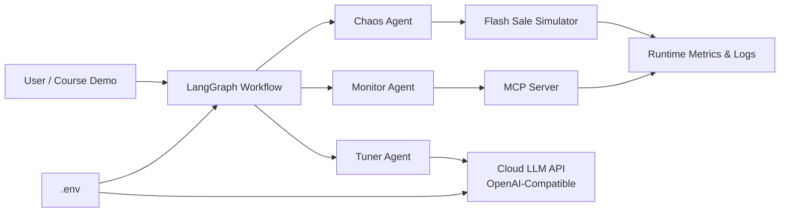
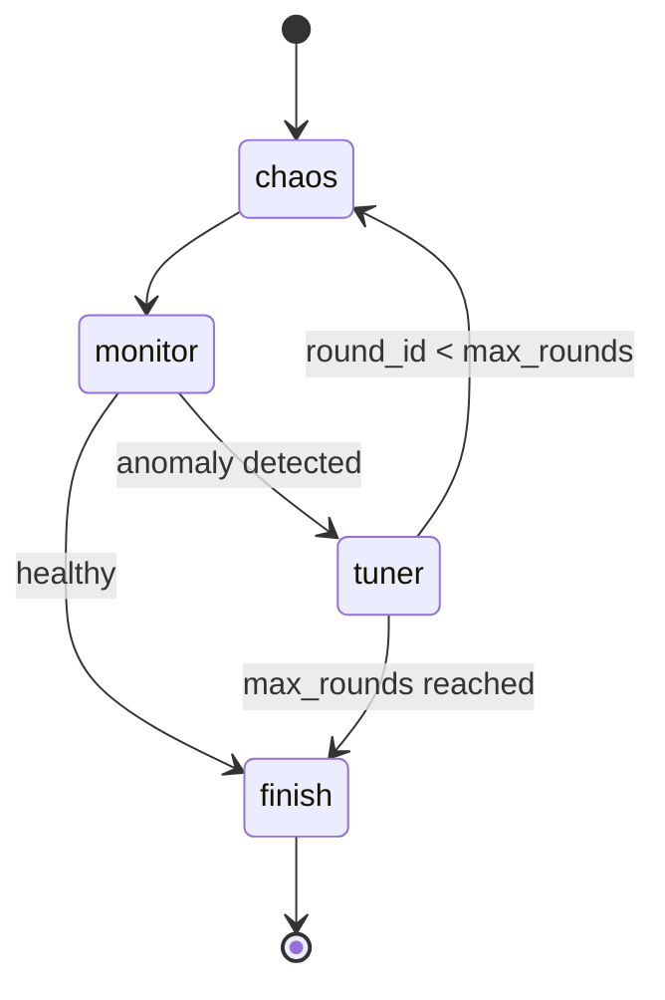
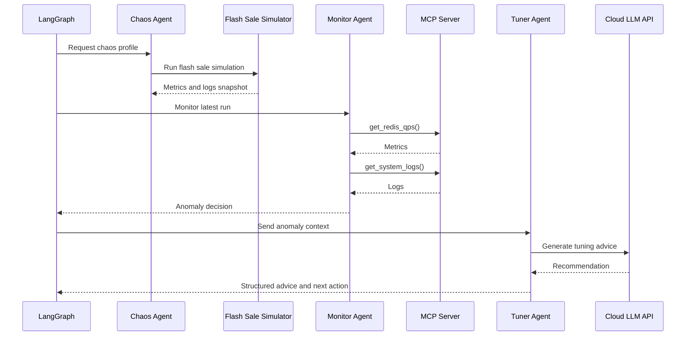
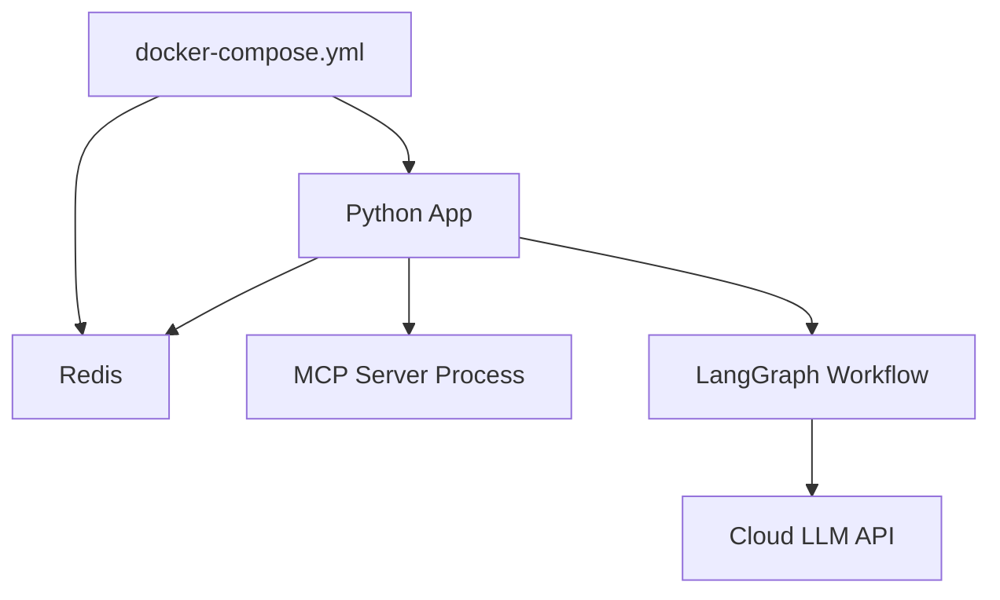

# Chaos-Tuner Agent Architecture Spec

## 1. 架构目标

Chaos-Tuner Agent 采用 SDD（Specification-Driven Development，规格驱动开发）方式组织工程。架构设计需要把产品规格映射为可运行组件，并保持演练靶机、MCP 工具、多智能体工作流和大模型调用之间的清晰边界。

核心目标：

- 用简易秒杀模拟器复现 TPS、Redis QPS、oversell 和 deadlock 等高并发信号。
- 用 MCP Server 暴露观测工具，隔离 Agent 与底层系统实现。
- 用 LangGraph 编排 Chaos、Monitor、Tuner 三类 Agent 节点。
- 用 `langchain-openai` 接入云端 OpenAI 兼容大模型 API。
- 用 `.env` 管理模型服务地址、模型名和 API Key，避免硬编码敏感信息。

## 2. 总体组件

## 3. 组件职责

### 3.1 Flash Sale Simulator

文件位置：`src/target_system/flash_sale.py`

职责：

- 接收并发量、库存量、持续时间等压测参数。
- 生成 TPS、Redis QPS、成功订单数、失败请求数等指标。
- 在并发超过安全阈值时产生异常日志。
- 异常类型至少包括 `oversell` 和 `deadlock`。

该模块是教学用 mock 靶机，不直接承担真实压测能力。它的价值在于稳定地产生可观测信号，供 Agent 闭环消费。

### 3.2 MCP Server

文件位置：`src/mcp_server/server.py`

职责：

- 使用官方 MCP Python SDK 实现工具服务。
- 暴露 `get_redis_qps()`，返回最近一次演练的 TPS、Redis QPS、并发量等指标。
- 暴露 `get_system_logs()`，返回最近一次演练的系统日志。
- 保持工具输出结构稳定，便于 Monitor Agent 解析。

MCP 是 Agent 与靶机之间的协议边界。后续可以把 mock 数据源替换成真实 Prometheus、Redis、ELK 或数据库查询，而不改变 Agent 编排层的主要逻辑。

### 3.3 LLM Config

文件位置：`src/agent/llm_config.py`

职责：

- 使用 `langchain-openai` 的 OpenAI 兼容接口创建 Chat Model。
- 从环境变量读取 `OPENAI_API_KEY`、`OPENAI_BASE_URL` 和 `OPENAI_MODEL`。
- 支持 DeepSeek、通义千问 DashScope 兼容模式或其他 OpenAI 兼容云端服务。
- 在 API Key 缺失时允许降级为规则建议，保证离线演示可运行。

本项目不依赖本地 Ollama，不要求本机具备 RTX 4090D 或其他高端 GPU。

### 3.4 Agent Nodes

文件位置：`src/agent/nodes.py`

职责：

- Chaos Agent：生成压测指令，并触发秒杀模拟器执行一轮演练。
- Monitor Agent：通过 MCP 工具读取 Redis QPS 和系统日志，判断是否出现 oversell、deadlock 或拥堵。
- Tuner Agent：接收异常上下文，调用云端大模型 API 或规则引擎，输出优化建议。

### 3.5 LangGraph Workflow

文件位置：`src/agent/graph.py`

职责：

- 定义状态字典 `State`。
- 组装 Chaos、Monitor、Tuner 节点。
- 通过 Conditional Edges 实现闭环控制。
- 在没有异常或达到最大轮次时结束演练。

## 4. 状态模型

`State` 建议包含以下字段：

- `round_id`：当前演练轮次。
- `max_rounds`：最大演练轮次。
- `chaos_profile`：当前压测配置，如并发量、库存量、持续时间。
- `metrics`：Monitor Agent 获取到的指标快照。
- `logs`：系统日志列表。
- `has_anomaly`：是否发现异常。
- `anomaly_type`：异常类型，例如 `oversell`、`deadlock`、`none`。
- `recommendations`：Tuner Agent 输出的优化建议列表。
- `next_action`：下一步动作，例如 `retry` 或 `finish`。

## 5. LangGraph 状态机

状态机含义：

1. `chaos` 生成并执行一轮压测。
2. `monitor` 读取指标和日志，判断是否异常。
3. 如果没有异常，进入 `finish`。
4. 如果存在异常，进入 `tuner` 生成调优建议。
5. 如果仍未达到最大轮次，则带着建议进入下一轮压测。
6. 如果达到最大轮次，则结束并输出最终结果。

## 6. MCP 工具协议边界

### 6.1 `get_redis_qps()`

输入：

- 可选参数 `window_seconds`，表示观测窗口，默认读取最近一次演练快照。

输出：

- `redis_qps`：Redis 模拟 QPS。
- `tps`：业务 TPS。
- `concurrency`：当前并发量。
- `success_orders`：成功订单数。
- `failed_requests`：失败请求数。
- `timestamp`：指标时间戳。

### 6.2 `get_system_logs()`

输入：

- 可选参数 `limit`，表示返回日志条数。

输出：

- `logs`：日志列表。
- `has_oversell`：是否存在超卖日志。
- `has_deadlock`：是否存在死锁日志。
- `latest_anomaly`：最近异常类型。

## 7. 数据流

## 8. 部署视图

部署约束：

- Python 应用容器负责运行 Agent 工作流和 MCP Server。
- Redis 容器作为工程环境预留服务，用于后续替换 mock 指标或扩展真实缓存交互。
- 云端大模型 API 不随容器部署，通过环境变量配置访问地址和 API Key。

## 9. 环境变量

`.env` 中建议包含：

- `OPENAI_API_KEY`：云端模型 API Key。
- `OPENAI_BASE_URL`：OpenAI 兼容接口地址。
- `OPENAI_MODEL`：模型名称。
- `ENABLE_LLM`：是否启用真实 LLM 调用。
- `REDIS_URL`：Redis 连接地址。

示例服务：

- DeepSeek：`https://api.deepseek.com`
- 通义千问 DashScope OpenAI 兼容模式：`https://dashscope.aliyuncs.com/compatible-mode/v1`

## 10. 扩展点

- 将模拟指标替换为 Prometheus 查询。
- 将系统日志替换为 ELK、Loki 或 OpenTelemetry 日志。
- 增加 Human-in-the-loop 审批节点。
- 增加自动执行调优动作的 Executor Agent。
- 增加回归压测报告和趋势对比。
